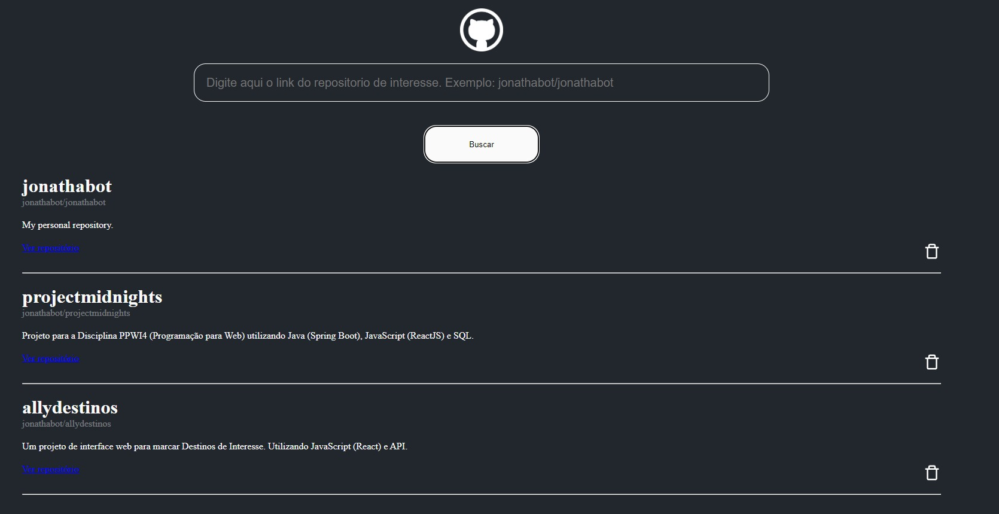

# Wiki de Repositórios do GitHub com React

Esse repositório é um desafio do Bootcamp ["Orange Tech +"](https://www.dio.me/bootcamp/orange-tech) da DIO. É uma wiki de repositorios de meu interesse no GitHub, consome a API disponibilizada pela propria empresa do GitHub. Feito interamente em React (Axios e Styled-components). Comandos: 1. "yarn" para baixar dependencias. 2. "yarn run" para iniciar a aplicação.

## Preview

